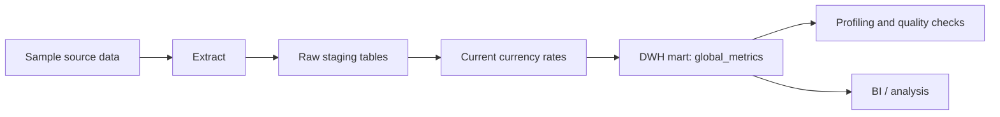

# Financial DWH Pipeline

Sanitized, locally reproducible demo for a batch financial data warehouse pipeline.

## Business Goal

Build an analytical pipeline that loads transaction and currency-rate data into a warehouse, creates a daily global metrics mart, and validates the output for business reporting.

## What This Demonstrates

- staging and analytical warehouse modeling;
- reproducible batch loading from source files;
- SQL mart construction;
- visible data-quality gates;
- deterministic source-version deduplication;
- dataset profiling and join-fanout protection;
- date-parameterized idempotent refresh and bounded historical backfill;
- Airflow-compatible orchestration entrypoints;
- a persistent local Airflow scheduler/webserver stack with verified bounded catchup;
- PostgreSQL-compatible execution of the warehouse-oriented SQL;
- a reproducible static dashboard generated from the checked mart;
- a publication boundary between private course work and synthetic demo data.

## Architecture



## Stack

- Python
- SQL
- SQLite for the zero-dependency local warehouse
- Vertica-oriented SQL examples for the analytical target
- Airflow DAG definitions with directly runnable Python callables
- Docker Compose for a minimal local run

## Project Structure

```text
de-financial-dwh-pipeline/
  dags/
  docs/
  sample_data/
  sql/
    local/
  src/
  tests/
```

## Local Run

The default local mode uses Python's built-in `sqlite3` module and synthetic CSV files. It creates `.local/financial_dwh.sqlite`, loads staging tables, builds the mart, and fails if any quality check is non-zero.

```bash
python -m src.local_warehouse
```

Refresh one date or an inclusive backfill range:

```bash
python -m src.local_warehouse --start-date 2024-01-01
python -m src.local_warehouse --start-date 2024-01-01 --end-date 2024-01-02
```

Each run replaces only the requested mart date range. Repeating the same range is idempotent and leaves other dates unchanged.

Run the standard-library test suite:

```bash
python -m unittest discover -s tests -v
```

Run the repeatable secrets audit:

```bash
python scripts/check_no_secrets.py
```

Regenerate the static dashboard from the checked local mart:

```bash
python scripts/build_dashboard.py
```

Open `docs/dashboard.html` to inspect the KPI summary, mart rows, refresh contract, and data-quality results. CI runs the generator in check mode and fails when the committed artifact is stale.

Run the orchestration callables without installing Airflow:

```bash
python -m dags.financial_dwh_pipeline
```

The same local pipeline can run in a clean Python container:

```bash
docker compose up --abort-on-container-exit
```

GitHub Actions runs this Docker Compose command on every push and pull request, then removes the test container and volumes.

CI also mounts the repository into the official `apache/airflow:2.10.5` image and requires all three DAG IDs to appear in `airflow dags list`.

Run and verify the bounded two-day catchup with a persistent LocalExecutor scheduler, webserver, and PostgreSQL metadata database:

```bash
python scripts/run_airflow_catchup.py
```

The verifier unpauses only `financial_dwh_pipeline`, waits for successful DAG runs on `2024-01-01` and `2024-01-02`, and requires both task instances to succeed in each run. The Airflow UI remains available at `http://localhost:8080` with demo credentials `admin` / `admin`.

Stop the stack and remove its metadata and log volumes:

```bash
docker compose -f docker-compose.airflow.yml down --volumes
```

Verify the publication-oriented warehouse SQL against PostgreSQL:

```bash
docker compose -f docker-compose.postgres.yml up --abort-on-container-exit --exit-code-from warehouse-verifier
docker compose -f docker-compose.postgres.yml down --volumes
```

The verifier creates `staging` and `dwh` schemas, loads the synthetic CSV sources, runs the mart SQL, and fails if any PostgreSQL quality assertion is non-zero. See `docs/postgres_warehouse_evidence.md`.

## Warehouse Mapping

The publication-oriented SQL keeps warehouse schemas such as `staging.transactions` and `dwh.global_metrics`. The local SQLite adapter uses equivalent prefixed tables:

| Warehouse Table | Local SQLite Table |
|---|---|
| `staging.transactions` | `staging_transactions` |
| `staging.currencies` | `staging_currencies` |
| `staging.currency_rates_current` | `staging_currency_rates_current` |
| `dwh.global_metrics` | `dwh_global_metrics` |

`docker-compose.postgres.yml` verifies that the warehouse-oriented SQL runs against PostgreSQL schemas directly, without the SQLite table-name adapter.

## Airflow

`dags/financial_dwh_pipeline.py` defines a two-task daily Airflow DAG when Airflow is installed:

1. `load_sources_to_staging`
2. `build_global_metrics_mart`

The mart task receives Airflow's `{{ ds }}` as both refresh boundaries. `catchup=True` is bounded to the synthetic sample period, and `max_active_runs=1` serializes writes to the shared SQLite demo warehouse. The task callables also run directly, which keeps local verification lightweight.

Full DAG discovery is verified in CI with the pinned official Airflow container. The separate Airflow Compose stack verifies successful scheduler-created catchup DAG runs and task instances locally and in CI.

See `docs/airflow_catchup_evidence.md` for the verified scheduled run IDs and task-instance contract.

## Example Result

The synthetic input produces three daily currency-level mart rows:

| date_update | currency_from | amount_total | amount_usd_total | transaction_count |
|---|---:|---:|---:|---:|
| `2024-01-01` | `840` | `120.50` | `120.50` | `1` |
| `2024-01-01` | `978` | `85.00` | `92.65` | `1` |
| `2024-01-02` | `840` | `200.00` | `200.00` | `1` |

See `docs/example_output.md` for the quality-check result table.

The same result is published as a self-contained dashboard in `docs/dashboard.html`.

## Data Quality Checks

Checks are defined in `sql/04_quality_checks.sql` and `sql/local/03_quality_checks.sql`:

- required fields are not null;
- transaction amounts are non-negative;
- currency rates are present for mart dates;
- `global_metrics` has one row per expected date/currency grain;
- current currency-rate grain is unique after deterministic deduplication;
- joining current rates does not multiply transaction rows.

The local run also prints a compact profile covering transaction volume, distinct operation IDs, time range, raw currency-rate rows, current rows, and superseded versions.

## Known Limitations

- SQLite is the local demo adapter, not a production substitute for Vertica.
- PostgreSQL verifies compatible schema and SQL behavior, not live Vertica execution.
- The persistent Airflow stack is intended for local portfolio verification, not production deployment.
- Docker Compose still requires a local Docker installation.
- The dashboard is a static publication artifact, not a live BI service.
- Sample data is synthetic and intentionally small.

## Recruiter Summary

Built a reproducible financial DWH demo that loads synthetic transaction and exchange-rate data, constructs a daily metrics mart, validates outputs with SQL quality gates, and exposes Airflow-compatible orchestration tasks.
