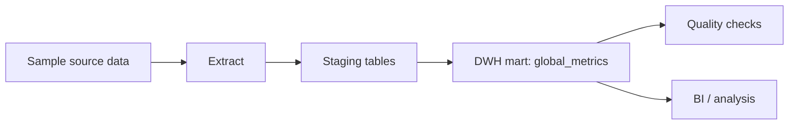

# Financial DWH Pipeline

Sanitized, locally reproducible demo for a batch financial data warehouse pipeline.

## Business Goal

Build an analytical pipeline that loads transaction and currency-rate data into a warehouse, creates a daily global metrics mart, and validates the output for business reporting.

## What This Demonstrates

- staging and analytical warehouse modeling;
- reproducible batch loading from source files;
- SQL mart construction;
- visible data-quality gates;
- Airflow-compatible orchestration entrypoints;
- a publication boundary between private course work and synthetic demo data.

## Architecture



## Stack

- Python
- SQL
- SQLite for the zero-dependency local warehouse
- Vertica-oriented SQL examples for the analytical target
- Airflow DAG definitions with directly runnable Python callables
- Docker Compose for a minimal local run

## Project Structure

```text
de-financial-dwh-pipeline/
  dags/
  docs/
  sample_data/
  sql/
    local/
  src/
  tests/
```

## Local Run

The default local mode uses Python's built-in `sqlite3` module and synthetic CSV files. It creates `.local/financial_dwh.sqlite`, loads staging tables, builds the mart, and fails if any quality check is non-zero.

```bash
python -m src.local_warehouse
```

Run the standard-library test suite:

```bash
python -m unittest discover -s tests -v
```

Run the repeatable secrets audit:

```bash
python scripts/check_no_secrets.py
```

Run the orchestration callables without installing Airflow:

```bash
python -m dags.financial_dwh_pipeline
```

The same local pipeline can run in a clean Python container:

```bash
docker compose up --abort-on-container-exit
```

## Warehouse Mapping

The publication-oriented SQL keeps warehouse schemas such as `staging.transactions` and `dwh.global_metrics`. The local SQLite adapter uses equivalent prefixed tables:

| Warehouse Table | Local SQLite Table |
|---|---|
| `staging.transactions` | `staging_transactions` |
| `staging.currencies` | `staging_currencies` |
| `dwh.global_metrics` | `dwh_global_metrics` |

## Airflow

`dags/financial_dwh_pipeline.py` defines a two-task Airflow DAG when Airflow is installed:

1. `load_sources_to_staging`
2. `build_global_metrics_mart`

The task callables also run directly, which keeps local verification lightweight.

## Example Result

The synthetic input produces three daily currency-level mart rows:

| date_update | currency_from | amount_total | amount_usd_total | transaction_count |
|---|---:|---:|---:|---:|
| `2024-01-01` | `840` | `120.50` | `120.50` | `1` |
| `2024-01-01` | `978` | `85.00` | `92.65` | `1` |
| `2024-01-02` | `840` | `200.00` | `200.00` | `1` |

See `docs/example_output.md` for the quality-check result table.

## Data Quality Checks

Initial checks are defined in `sql/04_quality_checks.sql`:

- required fields are not null;
- transaction amounts are non-negative;
- currency rates are present for mart dates;
- `global_metrics` has one row per expected date/currency grain.
- currency-rate source grain is unique in local mode.

## Known Limitations

- SQLite is the local demo adapter, not a production substitute for Vertica.
- Airflow DAG discovery has not been tested in a full Airflow installation.
- Docker Compose still requires a local Docker installation.
- Sample data is synthetic and intentionally small.

## Recruiter Summary

Built a reproducible financial DWH demo that loads synthetic transaction and exchange-rate data, constructs a daily metrics mart, validates outputs with SQL quality gates, and exposes Airflow-compatible orchestration tasks.
